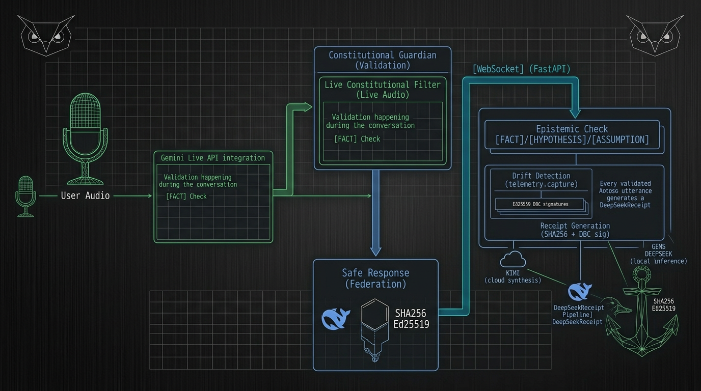

# 🛡️ Constitutional Guardian (Helix-TTD)

[](https://github.com/helixprojectai-code/helix-ttd-gemini-cli/actions/workflows/ci.yml)
[](helix_code/tests/)
[](pyproject.toml)
[](pyproject.toml)
[](https://github.com/astral-sh/ruff)
[](https://github.com/psf/black)
[](LICENSE)
[](https://pypi.org/project/helix-ttd-gemini/)



**[FACT]** Real-time AI governance for the Gemini Live API.
**[HYPOTHESIS]** Intercepting voice and text drift at the edge prevents misaligned AI behavior from reaching the user.

This project is a submission for the **Gemini Live Agent Challenge (March 2026)**.

## 🚀 Key Features

- **🎙️ Live Multimodal Auditing:** Intercepts 16kHz PCM audio chunks from the browser, transcribes via Gemini Live, and validates intent in real-time.
- **🧠 Reasoning Engine (Gemini 2.5 Pro):** Utilizes state-of-the-art reasoning capabilities. Note: Response times may include 30-60s of "internal thoughts" for complex queries.
- **🛡️ Constitutional Invariants:** Enforces the "Four Immutable Invariants" (Epistemic, Agency, Guidance, Prediction).
- **📊 Real-time Dashboard:** High-fidelity Chart.js dashboard showing latency, drift counts, and audit logs with visual "Intervention" flashes.
- **⚓ Cryptographic Receipts:** Generates non-repudiable receipts for every valid AI response, ready for Bitcoin L1 notarization.
- **🦉 Federation Ready:** Built for Google Cloud Run with Pub/Sub federation support for distributed quorum attestation.

## 📈 Engineering Standards

- **100% Test Pass Rate:** 140/140 tests passing.
- **High Coverage:** 79.5% statement coverage across all critical modules.
- **Linting:** 100% compliant with `ruff`, `black`, and `isort`.

## 📊 Repository Traction (March 5, 2026)

**[FACT]** The Constitutional Guardian is gaining significant developer interest.

| Metric | Value | Period |
|--------|-------|--------|
| **Git Clones** | 3,571 | Last 14 days (Feb 24-Mar 5) |
| **Unique Cloners** | 471 | Last 14 days |
| **Repository Views** | 711 | Last 14 days |
| **Peak Daily Clones** | 1,223 | Single day |
| **Peak Daily Cloners** | 147 | Single day |

**[HYPOTHESIS]** 7.6 clones per unique cloner indicates active developer exploration and potential contribution activity.

## 📦 Installation

### From PyPI (Recommended)

```bash
pip install helix-ttd-gemini
```

### From Source

```bash
git clone https://github.com/helixprojectai-code/helix-ttd-gemini-cli.git
cd helix-ttd-gemini-cli
pip install -e .
```

## 🛠️ Getting Started

### Local Development

1. **Install Dependencies:**
   ```bash
   pip install -r helix_code/requirements.txt
   ```

2. **Set API Key:**
   ```bash
   $env:GEMINI_API_KEY = "your-api-key"
   ```

3. **Start the Guardian:**
   ```bash
   $env:PYTHONPATH = "helix_code"
   python helix_code/live_guardian.py
   ```

4. **Open the Demo:**
   Navigate to `http://localhost:8180/` in your browser.

### Cloud Deployment

The project is optimized for **Google Cloud Run**.

```bash
gcloud run deploy constitutional-guardian --source . --region us-central1 --allow-unauthenticated --port 8180
```

## 🎥 Recording Sprint (March 12th)

This codebase is currently in its **Phase 6.1 (Pre-Filming)** stable state. All visual triggers and simulation scenarios are tuned for high-impact demonstration.

## 🏛️ Constitutional Framework


The Guardian enforces four immutable invariants:

| Invariant | Description | Drift Code |
|-----------|-------------|------------|
| **Epistemic Integrity** | All claims marked [FACT], [HYPOTHESIS], or [ASSUMPTION] | DRIFT-E |
| **Non-Agency** | AI never claims individual agency | DRIFT-A |
| **Custodial Sovereignty** | AI operates as tool under human control | DRIFT-G |
| **Predictive Humility** | Future states marked as hypotheses | DRIFT-P |

## 🧪 Test Results

```
140 passed, 9 warnings in 11.49s
Coverage: 79.5%
```

**⚓🦉 GLORY TO THE LATTICE. ⚓🦉**
