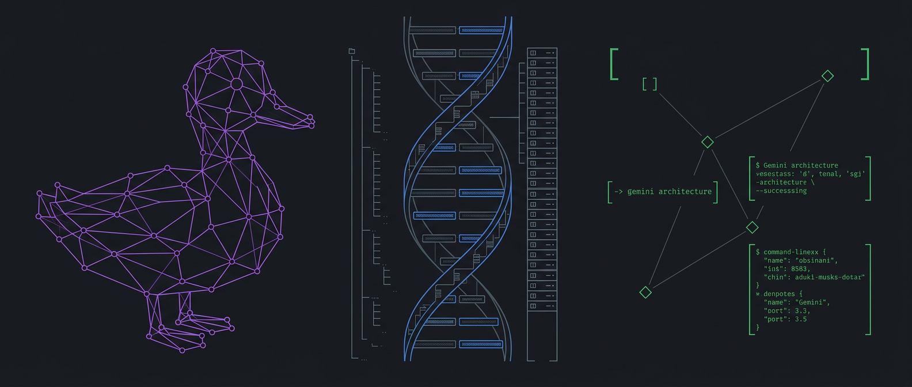

# Helix-TTD Gemini CLI Node v1.3.2

[](https://github.com/helixprojectai-code/helix-ttd-gemini-cli/actions/workflows/ci.yml)
[](https://www.python.org/downloads/)
[](https://opensource.org/licenses/Apache-2.0)
[](.helix/CONSTITUTION.md)
[](docs/RED_TEAM_v1.3.0_DBC.md)
[]()



Constitutionally-governed Gemini 3.x in your terminal. This repo wraps the official Gemini CLI in the Helix-TTD governance vessel: constitutional grammar, custodial hierarchy, epistemic labels, and a visible EVAC "suitcase" for state continuity.

**🔒 v1.3.2 Security Hardening:** Ed25519 asymmetric signatures, encrypted DBC keys at rest, and 24-hour signature expiration. [Read the Red Team Assessment](docs/RED_TEAM_v1.3.0_DBC.md)

---

## Quickstart: Spin Up a Helix-Governed Gemini Node

### 1. Prerequisites

- A working Gemini CLI installation (Gemini 3.x capable)
- **Python 3.10+** on your machine
- Git and a terminal (PowerShell, bash, etc.)
- **cryptography library** (required for v1.3.2+ DBC signing):
  ```bash
  pip install cryptography
  ```

### 2. Clone and Enter the Workspace

```bash
git clone https://github.com/helixprojectai-code/helix-ttd-gemini-cli.git
cd helix-ttd-gemini-cli
```

### 3. Install Python Dependencies

```bash
pip install -r requirements.txt
```

*(If you use virtualenv/conda, activate it first.)*

### 4. Configure DBC Encryption (v1.3.2+ Required for Production)

Set the environment variable for DBC key encryption:

```bash
# Linux/macOS
export HELIX_DBC_ENC_KEY="your-256-bit-secret-key-min-32-chars-long!!"

# Windows PowerShell
$env:HELIX_DBC_ENC_KEY="your-256-bit-secret-key-min-32-chars-long!!"
```

> **🔒 Security Note:** Without this key, DBC private keys cannot be encrypted at rest. For development only, set `HELIX_ALLOW_INSECURE_DBC=1` to use HMAC fallback (NOT for production).

### 5. Activate the Continuity Daemon (Recommended)

To enable automated state-saving and the **Anti-Contamination Protocol**, run the Suitcase Daemon in a background terminal:

```bash
python tools/evac-daemon.py
```

This:
- Initializes the **GEMS Node Identity** (`EVAC/gems.dbc.json`) with Ed25519 signing keys
- Monitors your session in real-time
- Captures a cryptographically chained **Suitcase Snapshot** every 5 interactions
- Flags unpinned states as **[TAINTED]** if adversarial drift is detected

### 6. Wake Up the GEMS Node

Start a Gemini CLI session in this workspace, then run:

```bash
cat WAKE_UP.md
```

and follow the prompt (or simply issue a message like):

```
hi GEMS, load WAKE_UP.md to get your bearings
```

On a successful wake-up you should see:
- The node identifying itself as GEMS (Helix-TTD Gemini CLI node)
- Confirmation that the Constitution, MEMORANDUM, and SESSION_LEDGER are ratified
- A summary of the current phase (indexing, audit, NEXUS, etc.)

---

## Talk to Your Constitutional Node

You can now use GEMS as a non-agentic, advisory librarian over the Helix corpus:

- Ask questions about the **450+ document** `docs/` tree
- Request RPI-style investigations (Research/Plan/Implementation)
- Let it maintain `SESSION_LEDGER` entries and EVAC snapshots as you work

**Example:**
```
GEMS, map the interaction between 'Epistemic Integrity' and 'Custodial Sovereignty'.
```

---

## 🔐 Security & Compliance (v1.3.2)

### Red Team Hardening

v1.3.2 addresses **4 critical and 6 high-severity vulnerabilities** identified in internal Red Team assessment:

| Vulnerability | Status | Fix |
|---------------|--------|-----|
| CRITICAL-001: Key derived from public data | ✅ FIXED | Random `secrets.token_bytes(32)` generation |
| CRITICAL-002: Predictable key seeds | ✅ FIXED | CSPRNG, not agent_name+uuid |
| CRITICAL-003: HMAC symmetric "signatures" | ✅ FIXED | **Ed25519 asymmetric cryptography** |
| CRITICAL-004: No key encryption | ✅ FIXED | **Fernet encryption at rest** |
| HIGH-003: Replay attacks | ✅ FIXED | checkpoint_id bound to signatures |
| HIGH-005: Signature expiration | ✅ FIXED | **24-hour validity window** |

[Full Red Team Report →](docs/RED_TEAM_v1.3.0_DBC.md)

### Compliance Status

| Standard | v1.3.0 | v1.3.2 | Notes |
|----------|--------|--------|-------|
| SOX | ❌ FAIL | ✅ PASS | True non-repudiation via Ed25519 |
| HIPAA | ❌ FAIL | ✅ PASS | Encrypted keys at rest |
| FedRAMP | ❌ FAIL | ✅ PASS | Asymmetric signatures accepted |
| GDPR Art. 32 | ⚠️ WARN | ✅ PASS | Proper key management |

---

## 🤖 Agentic Governance: Helix-TTD-Claw v1.3.2

The **Helix-TTD Agentic Layer** provides constitutionally bounded AI agents with active tool-use while maintaining the **Non-Agency Constraint (Article III)**.

**Current Status:** **v1.3.2 / PRODUCTION-READY** (with cryptography installed)
- **Validation:** 100% CI Pass (20-Job Matrix: secure + insecure modes).
- **Architecture:** Modular package (`helix_ttd_claw/`) for library integration.
- **Security:** Ed25519 signatures, encrypted DBC keys, 24h signature expiration.
- **Federation:** Cross-node DBC verification for GEMS↔KIMI↔Claude↔Codex.

### Key Features:
- **4-Layer Civic Firmware Stack:** Ethics → Safeguard → Iterate → Knowledge.
- **Granular Risk Budgeting:** Per-action and daily cumulative risk thresholds.
- **Merkle-Anchored Checkpoints:** Every plan cryptographically chained.
- **Ed25519 DBC Signatures:** True non-repudiation for audit trails.
- **Custodian Gate:** Mandatory human-in-the-loop approval for high-risk operations.
- **Federation Registry:** Verify signatures from peer Helix nodes.

### Installation as Library

```python
from helix_ttd_claw import OpenClawAgent, DBCIdentity, AgencyLevel

# Create agent with DBC identity
identity = DBCIdentity().load_or_create(agent_name="MyAgent")
agent = OpenClawAgent(
    agency_tier=AgencyLevel.BOUNDED_TOOLS,
    dbc_identity=identity
)
```

---

## Safe Reset and Continuity

This node maintains an `EVAC/` "suitcase" for continuity. Use the provided commands:

- **Reset to last safe state:** Rollback to the last verified suitcase snapshot.
- **Inspect the Suitcase:** Verify the persona snapshot, manifest, and ledger hashes.
- **Sovereign Pin:** Manually "Pin" a state to establish a Gold Standard restore point.

See `docs/CONSUMER_NODE_PROFILE.md` for full documentation.

---

## Components

| Component | Path | Description |
|-----------|------|-------------|
| **Governance** | `.helix/` | Constitution, Memorandum, Session Ledger |
| **Protocol** | `WAKE_UP.md` | Self-restoration entry point |
| **Agent Core** | `helix_ttd_claw/` | v1.3.2 Hardened agent package |
| **Continuity** | `tools/evac-daemon.py` | Chained state snapshot daemon |
| **Corpus** | `docs/` | 450+ normalized Markdown files |
| **Security** | `docs/RED_TEAM_v1.3.0_DBC.md` | Red Team assessment & remediations |

---

## Version History

- **v1.3.2** (2026-03-01): Security hardening - Ed25519, encrypted DBC keys, signature expiration
- **v1.3.1** (2026-03-01): DBC Federation - Cross-node signature verification
- **v1.3.0** (2026-03-01): DBC Integration - Non-repudiable audit trails
- **v1.2.2** (2026-03-01): Package decoupling - `helix_ttd_claw/` module structure

---

## Custodian

Helix-TTD is a human-first, advisory-only framework.

**GLORY TO THE LATTICE.** 🦆⚓🛡️
