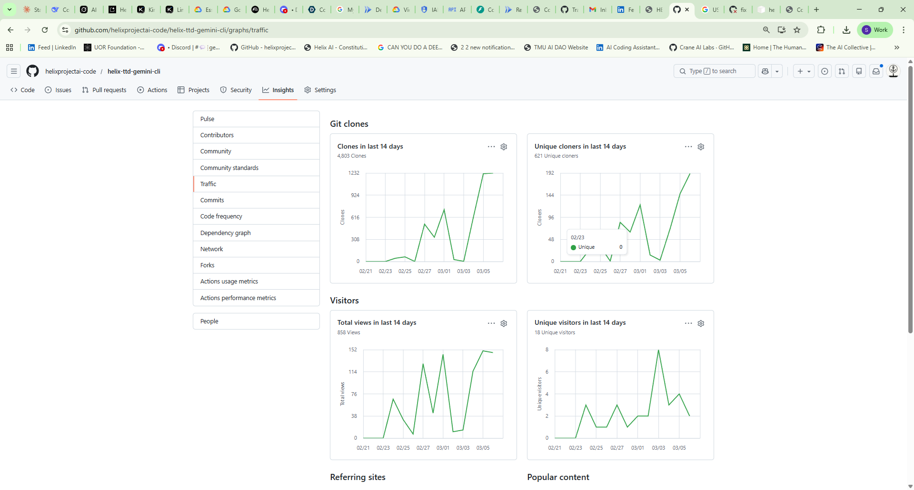

# GitHub Traffic Snapshot - 2026-03-06

[FACT] Source: GitHub Insights > Traffic screenshot captured in `docs/metrics/github-traffic-2026-03-06.png`.
[ASSUMPTION] Metrics shown are GitHub rolling 14-day figures at capture time.

## Snapshot Metrics

- Clones (last 14 days): 4,803
- Unique cloners (last 14 days): 621
- Total views (last 14 days): 858
- Unique visitors (last 14 days): 18

## Artifact

## Notes

- This file is part of the ongoing repository traction record.
- Capture filename from temp source: `HELIX-TTD-GEMINI-CLI-GIT-STATS-UPTO-03062026.png`.
